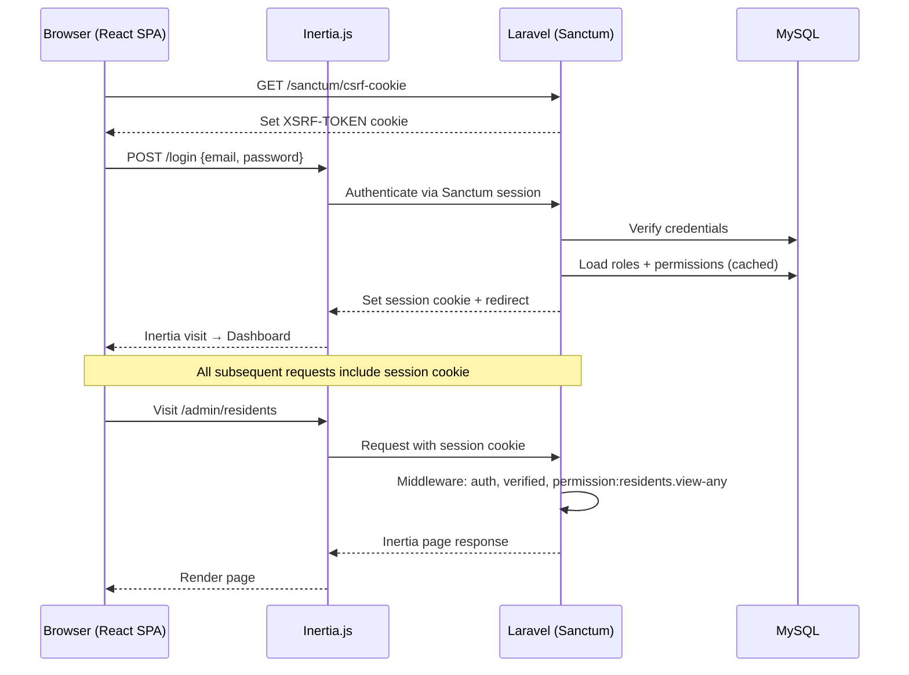

# Auth Strategy

## Decision: Breeze + Spatie Laravel Permission

### Options Evaluated

| Package | Pros | Cons | Verdict |
|---|---|---|---|
| **Laravel Breeze** | Already installed; clean controllers; Inertia+React scaffolding; fully customizable | No built-in permissions/roles beyond basic auth | **Keep** |
| **Laravel Jetstream** | Teams, 2FA, API tokens, profile photos | Opinionated UI; teams feature unused; overkill for this project; would require ripping out existing Breeze scaffolding | Reject |
| **Laravel Fortify** | Headless auth backend; no UI opinions | Redundant — Breeze already provides the auth controllers and views. Fortify would require rewriting what already works | Reject |

### Why Breeze Wins

Breeze is already installed and working. It provides:
- Login / Register / Password Reset / Email Verification
- Clean, customizable auth controllers (already in `app/Http/Controllers/Auth/`)
- Inertia + React page components (already in `resources/js/Pages/Auth/`)
- Sanctum cookie-based SPA authentication

**None of the three options provide granular permissions.** The permission layer must be added separately regardless of which auth package is used.

### Permission Layer: Spatie Laravel Permission

The current codebase has a hand-rolled `roles` table with a simple `hasRole()` check. This is insufficient for granular permission control across 3 user types and 4+ service areas.

**Spatie Laravel Permission** (`spatie/laravel-permission`) provides:
- Role-based AND permission-based access control
- `can()` / `@can` / Gate integration
- Middleware: `role:admin`, `permission:manage-residents`
- Cacheable permission lookups
- Migration from existing role system is straightforward

### Migration from Current Role System

The existing `roles` and `role_user` tables will be replaced by Spatie's tables:
- `roles` → Spatie's `roles` table (drop custom)
- `role_user` → `model_has_roles` (Spatie)
- NEW: `permissions` table
- NEW: `role_has_permissions` table
- NEW: `model_has_permissions` table (for direct user-permission assignments)

Existing `hasRole()` / `hasAnyRole()` methods on the User model will be replaced by Spatie's trait.

---

## Role Definitions

| Role | Description | Scope |
|---|---|---|
| `admin` | Barangay administrator. Full system access. | All modules, all actions |
| `staff` | Barangay staff/clerk. Day-to-day operations. | Assigned modules, most CRUD |
| `resident` | Registered community resident. Self-service portal. | Own data, request submission |

## Permission Matrix

### Resident Module

| Permission | Admin | Staff | Resident |
|---|---|---|---|
| `residents.view-any` | ✅ | ✅ | ❌ |
| `residents.view` | ✅ | ✅ | Own only |
| `residents.create` | ✅ | ✅ | Own profile |
| `residents.update` | ✅ | ✅ | Own profile |
| `residents.delete` | ✅ | ❌ | ❌ |
| `residents.verify` | ✅ | ✅ | ❌ |
| `residents.export` | ✅ | ✅ | ❌ |

### Household Module

| Permission | Admin | Staff | Resident |
|---|---|---|---|
| `households.view-any` | ✅ | ✅ | ❌ |
| `households.view` | ✅ | ✅ | Own only |
| `households.create` | ✅ | ✅ | ❌ |
| `households.update` | ✅ | ✅ | ❌ |
| `households.delete` | ✅ | ❌ | ❌ |

### Document Request Module

| Permission | Admin | Staff | Resident |
|---|---|---|---|
| `document-requests.view-any` | ✅ | ✅ | ❌ |
| `document-requests.view` | ✅ | ✅ | Own only |
| `document-requests.create` | ✅ | ✅ | ✅ (own) |
| `document-requests.update` | ✅ | ✅ | ❌ |
| `document-requests.approve` | ✅ | ✅ | ❌ |
| `document-requests.reject` | ✅ | ✅ | ❌ |
| `document-requests.release` | ✅ | ✅ | ❌ |
| `document-requests.cancel` | ✅ | ✅ | Own (pending only) |

### Blotter Module

| Permission | Admin | Staff | Resident |
|---|---|---|---|
| `blotters.view-any` | ✅ | ✅ | ❌ |
| `blotters.view` | ✅ | ✅ | Own (as party) |
| `blotters.create` | ✅ | ✅ | ✅ (file complaint) |
| `blotters.update` | ✅ | ✅ | ❌ |
| `blotters.resolve` | ✅ | ✅ | ❌ |
| `blotters.schedule-hearing` | ✅ | ✅ | ❌ |

### Social Assistance Module

| Permission | Admin | Staff | Resident |
|---|---|---|---|
| `assistance-programs.view-any` | ✅ | ✅ | ✅ (published) |
| `assistance-programs.create` | ✅ | ❌ | ❌ |
| `assistance-programs.update` | ✅ | ✅ | ❌ |
| `assistance-programs.delete` | ✅ | ❌ | ❌ |
| `assistance-applications.view-any` | ✅ | ✅ | ❌ |
| `assistance-applications.view` | ✅ | ✅ | Own only |
| `assistance-applications.create` | ✅ | ✅ | ✅ (own) |
| `assistance-applications.approve` | ✅ | ✅ | ❌ |
| `assistance-applications.reject` | ✅ | ✅ | ❌ |
| `assistance-applications.disburse` | ✅ | ✅ | ❌ |

### Payment Module

| Permission | Admin | Staff | Resident |
|---|---|---|---|
| `payments.view-any` | ✅ | ✅ | ❌ |
| `payments.view` | ✅ | ✅ | Own only |
| `payments.create` | ✅ | ✅ | ✅ (own requests) |
| `payments.refund` | ✅ | ❌ | ❌ |
| `payments.export` | ✅ | ✅ | ❌ |

### System / Admin

| Permission | Admin | Staff | Resident |
|---|---|---|---|
| `users.manage` | ✅ | ❌ | ❌ |
| `roles.manage` | ✅ | ❌ | ❌ |
| `audit-logs.view` | ✅ | ❌ | ❌ |
| `officials.manage` | ✅ | ✅ | ❌ |
| `announcements.manage` | ✅ | ✅ | ❌ |
| `events.manage` | ✅ | ✅ | ❌ |
| `dashboard.admin` | ✅ | ✅ | ❌ |
| `dashboard.resident` | ❌ | ❌ | ✅ |

## Auth Flow

## Implementation Notes

1. Install `spatie/laravel-permission` — run vendor publish and migrations
2. Add `HasRoles` trait to User model (replaces custom `hasRole()`)
3. Create `RoleAndPermissionSeeder` with the full matrix above
4. Replace `role:resident` middleware with Spatie's `role:resident` or `permission:...`
5. Use Laravel Policies for resource-level authorization (not just middleware)
6. Share `auth.user.roles` and `auth.user.permissions` via `HandleInertiaRequests`
