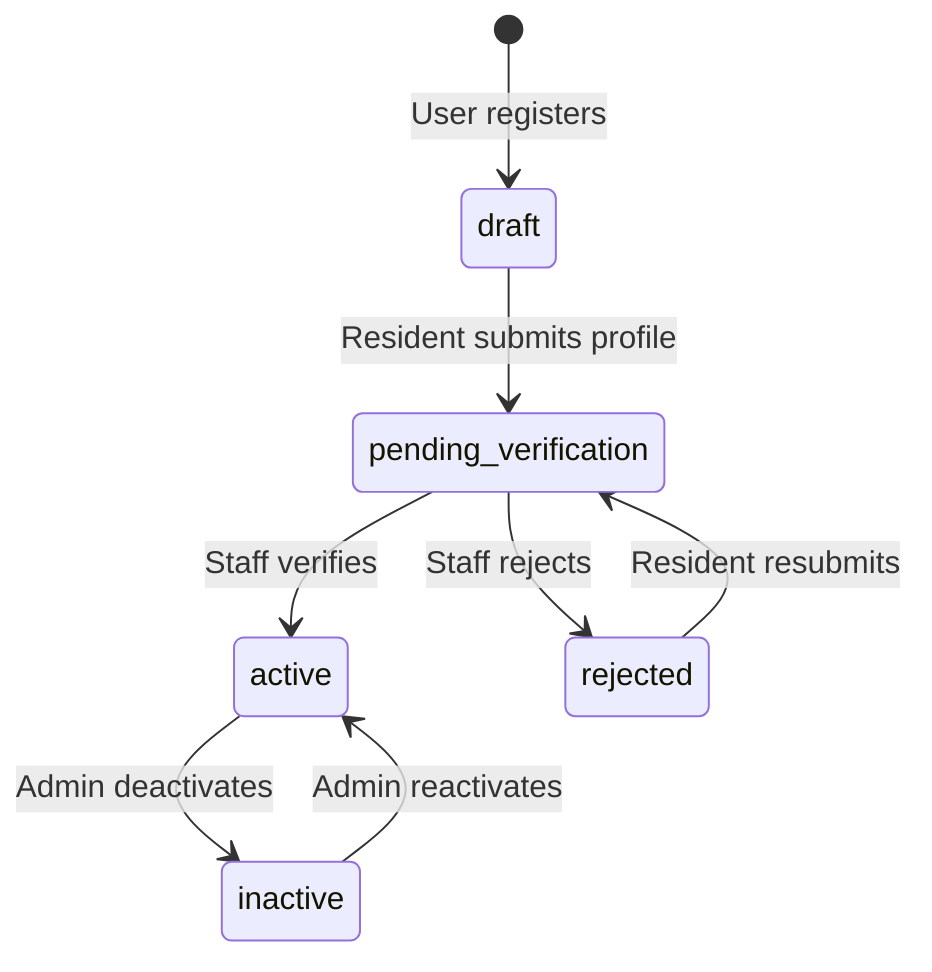
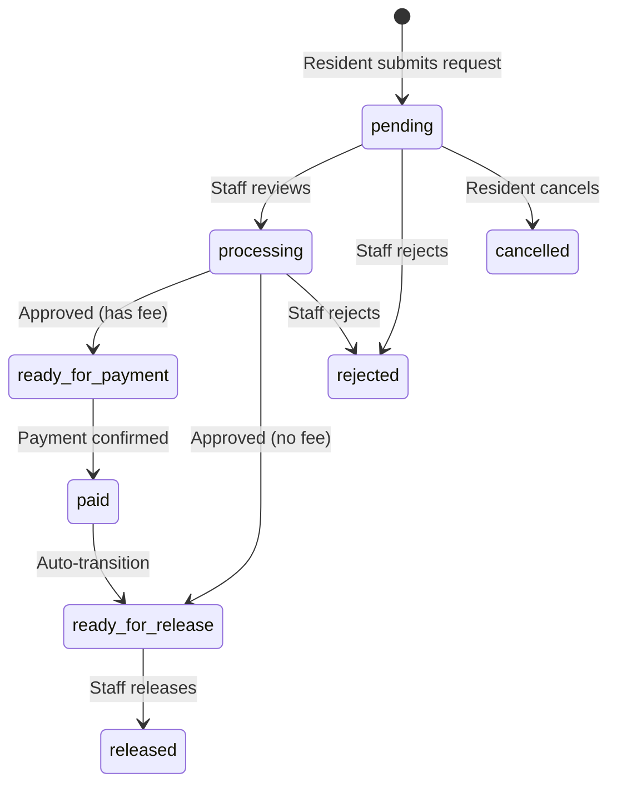
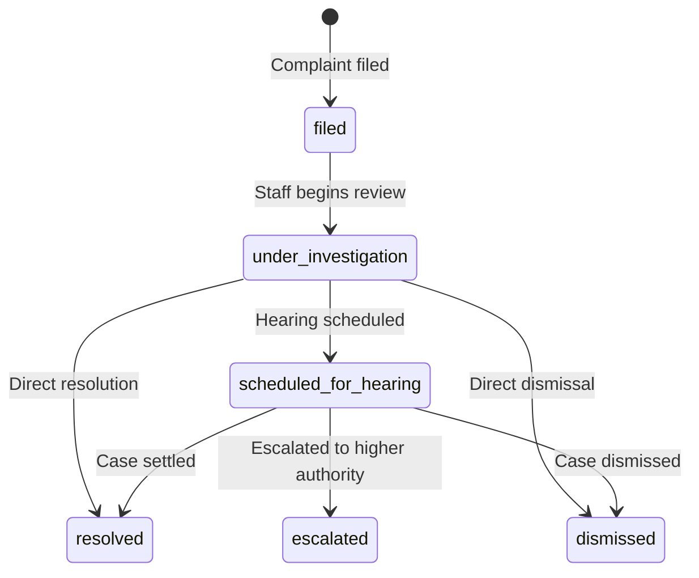
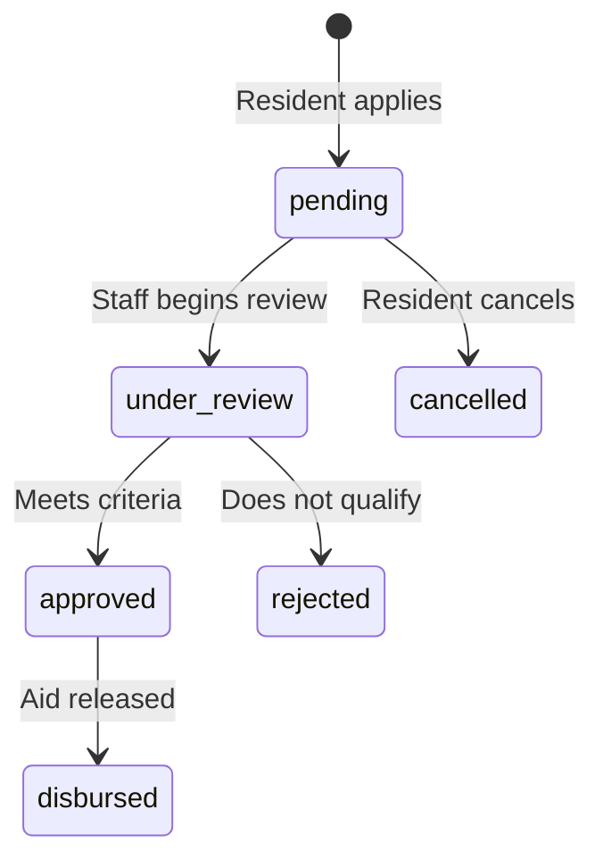
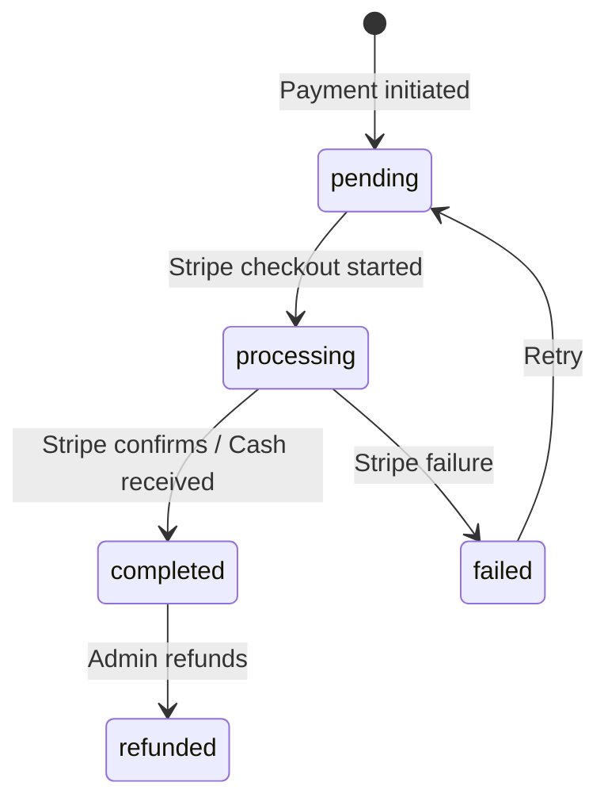

# Database Design

## Entity-Relationship Diagram

```mermaid
erDiagram
    %% ──────────────────────────────────────────────
    %% CORE / AUTH
    %% ──────────────────────────────────────────────
    users {
        bigint id PK
        string name
        string email UK
        timestamp email_verified_at
        string password
        string remember_token
        timestamps created_at
        timestamps updated_at
    }

    roles {
        bigint id PK
        string name UK
        string guard_name
        timestamps created_at
        timestamps updated_at
    }

    permissions {
        bigint id PK
        string name UK
        string guard_name
        timestamps created_at
        timestamps updated_at
    }

    model_has_roles {
        bigint role_id FK
        string model_type
        bigint model_id
    }

    model_has_permissions {
        bigint permission_id FK
        string model_type
        bigint model_id
    }

    role_has_permissions {
        bigint permission_id FK
        bigint role_id FK
    }

    audit_logs {
        bigint id PK
        bigint user_id FK "nullable"
        string auditable_type
        bigint auditable_id
        string action
        json old_values "nullable"
        json new_values "nullable"
        text description "nullable"
        string ip_address "nullable"
        timestamps created_at
        timestamps updated_at
    }

    %% ──────────────────────────────────────────────
    %% RESIDENT MODULE
    %% ──────────────────────────────────────────────
    residents {
        bigint id PK
        bigint user_id FK "unique"
        string first_name
        string middle_name "nullable"
        string last_name
        string suffix "nullable"
        date birthdate
        enum gender "male,female"
        enum civil_status "single,married,widowed,separated,divorced"
        string contact_number "nullable"
        text address
        string purok "nullable"
        bigint household_id FK "nullable"
        string photo "nullable"
        enum status "draft,pending_verification,active,inactive,rejected"
        text verification_notes "nullable"
        bigint verified_by FK "nullable"
        timestamp verified_at "nullable"
        timestamps created_at
        timestamps updated_at
    }

    %% ──────────────────────────────────────────────
    %% HOUSEHOLD MODULE
    %% ──────────────────────────────────────────────
    households {
        bigint id PK
        bigint head_id FK "nullable"
        string household_number UK
        text address
        string purok "nullable"
        timestamps created_at
        timestamps updated_at
    }

    %% ──────────────────────────────────────────────
    %% OFFICIAL MODULE
    %% ──────────────────────────────────────────────
    officials {
        bigint id PK
        bigint resident_id FK
        string position
        string committee "nullable"
        date term_start
        date term_end
        enum status "active,inactive,ended"
        timestamps created_at
        timestamps updated_at
    }

    %% ──────────────────────────────────────────────
    %% DOCUMENT REQUEST MODULE
    %% ──────────────────────────────────────────────
    document_types {
        bigint id PK
        string name UK
        string code UK "e.g. brgy-clearance, brgy-indigency"
        text description "nullable"
        decimal fee "default 0.00"
        text requirements "nullable — JSON array"
        boolean is_active "default true"
        timestamps created_at
        timestamps updated_at
    }

    document_requests {
        bigint id PK
        string reference_number UK
        bigint resident_id FK
        bigint document_type_id FK
        string purpose
        enum status "pending,processing,ready_for_payment,paid,ready_for_release,released,cancelled,rejected"
        text remarks "nullable"
        string or_number "nullable"
        decimal fee
        bigint processed_by FK "nullable"
        timestamp released_at "nullable"
        timestamps created_at
        timestamps updated_at
    }

    %% ──────────────────────────────────────────────
    %% BLOTTER MODULE
    %% ──────────────────────────────────────────────
    blotters {
        bigint id PK
        string case_number UK
        bigint complainant_id FK
        bigint respondent_id FK "nullable"
        string respondent_name "nullable — for non-resident respondents"
        enum incident_type "noise,property,assault,theft,domestic,dispute,other"
        text narrative
        date incident_date
        string incident_location
        enum status "filed,under_investigation,scheduled_for_hearing,resolved,dismissed,escalated"
        text resolution "nullable"
        bigint recorded_by FK
        timestamps created_at
        timestamps updated_at
    }

    blotter_hearings {
        bigint id PK
        bigint blotter_id FK
        datetime scheduled_at
        string venue
        text notes "nullable"
        enum outcome "pending,settled,unresolved,rescheduled"
        bigint presided_by FK "nullable"
        timestamps created_at
        timestamps updated_at
    }

    %% ──────────────────────────────────────────────
    %% SOCIAL ASSISTANCE MODULE (NEW)
    %% ──────────────────────────────────────────────
    assistance_programs {
        bigint id PK
        string name
        text description "nullable"
        enum program_type "financial,medical,educational,livelihood,disaster_relief,other"
        decimal budget "nullable"
        decimal amount_per_beneficiary "nullable"
        int max_beneficiaries "nullable"
        date application_start "nullable"
        date application_end "nullable"
        enum status "draft,open,closed,completed"
        text eligibility_criteria "nullable — JSON"
        bigint created_by FK
        timestamps created_at
        timestamps updated_at
    }

    assistance_applications {
        bigint id PK
        string reference_number UK
        bigint program_id FK
        bigint resident_id FK
        text reason
        json supporting_documents "nullable — file paths"
        enum status "pending,under_review,approved,rejected,disbursed,cancelled"
        text review_notes "nullable"
        bigint reviewed_by FK "nullable"
        timestamp reviewed_at "nullable"
        decimal disbursed_amount "nullable"
        timestamp disbursed_at "nullable"
        timestamps created_at
        timestamps updated_at
    }

    %% ──────────────────────────────────────────────
    %% PAYMENT MODULE
    %% ──────────────────────────────────────────────
    payments {
        bigint id PK
        string transaction_reference UK
        bigint resident_id FK
        string payable_type "polymorphic"
        bigint payable_id "polymorphic"
        decimal amount
        enum payment_method "stripe,cash,other"
        string stripe_payment_intent_id "nullable"
        string stripe_checkout_session_id "nullable"
        enum status "pending,processing,completed,failed,refunded"
        string or_number "nullable"
        text remarks "nullable"
        timestamp paid_at "nullable"
        timestamps created_at
        timestamps updated_at
    }

    %% ──────────────────────────────────────────────
    %% ANNOUNCEMENT MODULE
    %% ──────────────────────────────────────────────
    announcements {
        bigint id PK
        bigint user_id FK
        string title
        text body
        string category "nullable"
        boolean is_pinned "default false"
        timestamp published_at "nullable"
        timestamps created_at
        timestamps updated_at
    }

    %% ──────────────────────────────────────────────
    %% EVENT MODULE
    %% ──────────────────────────────────────────────
    events {
        bigint id PK
        string title
        text description "nullable"
        string location "nullable"
        datetime starts_at
        datetime ends_at "nullable"
        enum status "upcoming,ongoing,completed,cancelled"
        bigint created_by FK
        timestamps created_at
        timestamps updated_at
    }

    %% ──────────────────────────────────────────────
    %% NOTIFICATIONS (Laravel built-in)
    %% ──────────────────────────────────────────────
    notifications {
        uuid id PK
        string type
        string notifiable_type
        bigint notifiable_id
        text data
        timestamp read_at "nullable"
        timestamps created_at
        timestamps updated_at
    }

    %% ──────────────────────────────────────────────
    %% RELATIONSHIPS
    %% ──────────────────────────────────────────────

    users ||--o| residents : "has one"
    users ||--o{ audit_logs : "performed"
    users ||--o{ announcements : "authored"
    users ||--o{ events : "created"

    roles ||--o{ model_has_roles : "assigned to"
    roles ||--o{ role_has_permissions : "has"
    permissions ||--o{ role_has_permissions : "granted via"
    permissions ||--o{ model_has_permissions : "directly granted"

    residents ||--o| households : "belongs to"
    households ||--o{ residents : "has members"
    households ||--o| residents : "head"

    residents ||--o{ officials : "serves as"
    residents ||--o{ document_requests : "requested"
    residents ||--o{ blotters : "filed (complainant)"
    residents ||--o{ payments : "made"
    residents ||--o{ assistance_applications : "applied"

    document_types ||--o{ document_requests : "categorizes"
    document_requests ||--o{ payments : "payable (polymorphic)"

    blotters ||--o{ blotter_hearings : "has hearings"

    assistance_programs ||--o{ assistance_applications : "receives applications"
    assistance_applications ||--o{ payments : "payable (polymorphic)"
```

## Entity Descriptions

### Core Entities

| Entity | Purpose |
|---|---|
| `users` | Authentication accounts. Every system user (admin, staff, resident) has one. |
| `roles` | Spatie Permission roles: `admin`, `staff`, `resident`. |
| `permissions` | Granular permission keys (e.g., `residents.view-any`, `blotters.create`). |
| `audit_logs` | Polymorphic audit trail. Tracks who changed what, when, and from/to values. |
| `notifications` | Laravel's built-in notification table. Stores email-sent and in-app notification records. |

### Resident & Household

| Entity | Purpose |
|---|---|
| `residents` | Core resident profile. Linked 1:1 to a user account. Contains demographic data, verification workflow status. |
| `households` | Groups residents into households. One resident designated as head. |

### Officials

| Entity | Purpose |
|---|---|
| `officials` | Barangay elected/appointed officials. Links a resident to a position and term. |

### Document Requests

| Entity | Purpose |
|---|---|
| `document_types` | Catalog of available barangay certificates/documents with standard fees. Acts as a configuration table. |
| `document_requests` | Individual certificate requests. Tracks the full lifecycle: request → review → payment → release. |

### Blotter / Incident

| Entity | Purpose |
|---|---|
| `blotters` | Incident/complaint records. Tracks complainant, respondent, incident details, and resolution status. |
| `blotter_hearings` | Hearing sessions scheduled for a blotter case. Tracks outcome and presiding official. |

### Social Assistance

| Entity | Purpose |
|---|---|
| `assistance_programs` | Defined assistance programs (e.g., "4Ps", "Medical Aid", "Scholarship"). Includes budget, eligibility, and application window. |
| `assistance_applications` | Individual applications to a program. Tracks review, approval, and disbursement. |

### Payments

| Entity | Purpose |
|---|---|
| `payments` | Polymorphic payment records. Can be attached to `document_requests`, `assistance_applications`, or any future payable. Includes Stripe integration fields. |

### Content

| Entity | Purpose |
|---|---|
| `announcements` | Barangay announcements/news. Supports pinning and scheduled publishing. |
| `events` | Community events with date range and status tracking. |

## Status Enums

### Resident Status Flow

### Document Request Status Flow

### Blotter Status Flow

### Assistance Application Status Flow

### Payment Status Flow

## Indexes

Key indexes beyond primary/foreign keys:

| Table | Column(s) | Type | Reason |
|---|---|---|---|
| `residents` | `status` | INDEX | Frequent filter by verification status |
| `residents` | `last_name, first_name` | INDEX | Name search |
| `residents` | `purok` | INDEX | Filter by purok |
| `document_requests` | `reference_number` | UNIQUE | Lookup by reference |
| `document_requests` | `status` | INDEX | Dashboard filters |
| `document_requests` | `resident_id, status` | COMPOSITE | Resident's pending requests |
| `blotters` | `case_number` | UNIQUE | Lookup by case number |
| `blotters` | `status` | INDEX | Dashboard filters |
| `blotters` | `complainant_id` | INDEX | Resident's filed complaints |
| `assistance_programs` | `status` | INDEX | Active programs listing |
| `assistance_applications` | `reference_number` | UNIQUE | Lookup by reference |
| `assistance_applications` | `program_id, status` | COMPOSITE | Program applicant counts |
| `payments` | `transaction_reference` | UNIQUE | Payment lookup |
| `payments` | `stripe_payment_intent_id` | INDEX | Webhook reconciliation |
| `payments` | `payable_type, payable_id` | COMPOSITE | Polymorphic lookup |
| `audit_logs` | `auditable_type, auditable_id` | COMPOSITE | History lookup |
| `notifications` | `notifiable_type, notifiable_id` | COMPOSITE | User notification inbox |

## Migration from Current Schema

### Tables to Drop (replaced by Spatie)
- `roles` (custom) → replaced by `spatie/laravel-permission` roles table
- `role_user` → replaced by `model_has_roles`

### Tables to Alter
- `residents` — add `status` enum refinement, ensure all enum values match spec
- `document_requests` — add `reference_number`, `document_type_id` FK, `processed_by` FK; drop raw `document_type` string
- `blotters` — add `case_number`, `respondent_name`, `recorded_by`; refine status enum
- `payments` — add `transaction_reference`, `payment_method`, `stripe_payment_intent_id`, `stripe_checkout_session_id`; refine status enum

### Tables to Create
- `document_types` — new configuration table
- `blotter_hearings` — new sub-table
- `assistance_programs` — new module table
- `assistance_applications` — new module table
- `notifications` — Laravel's built-in (if not already present)
- Spatie permission tables (`roles`, `permissions`, `model_has_roles`, `model_has_permissions`, `role_has_permissions`)
