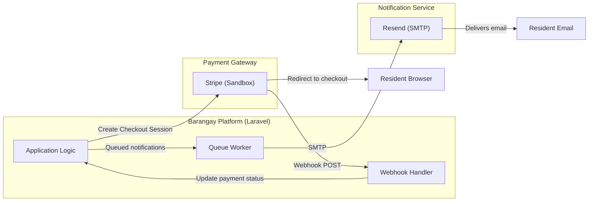
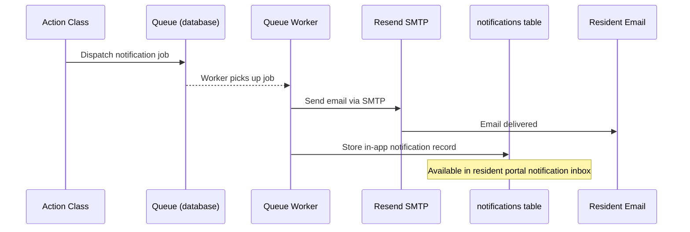
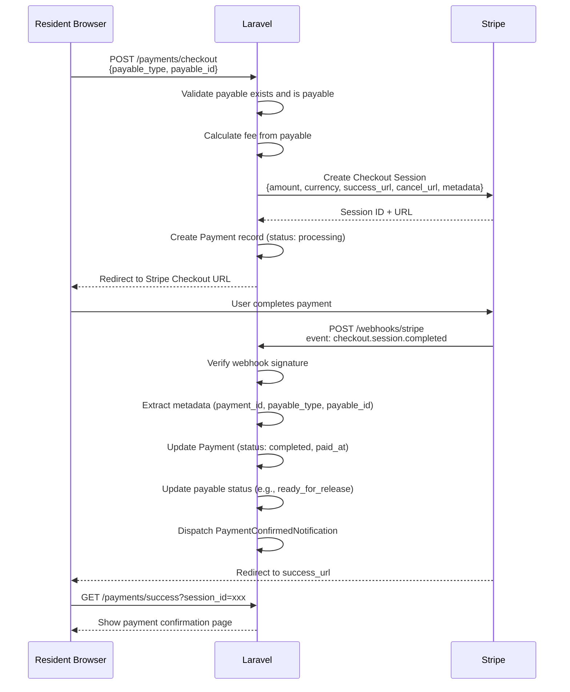
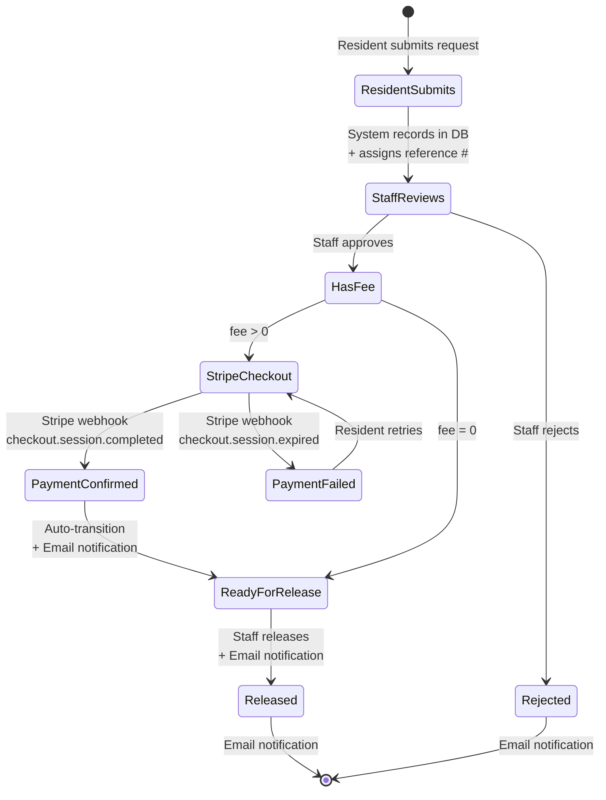
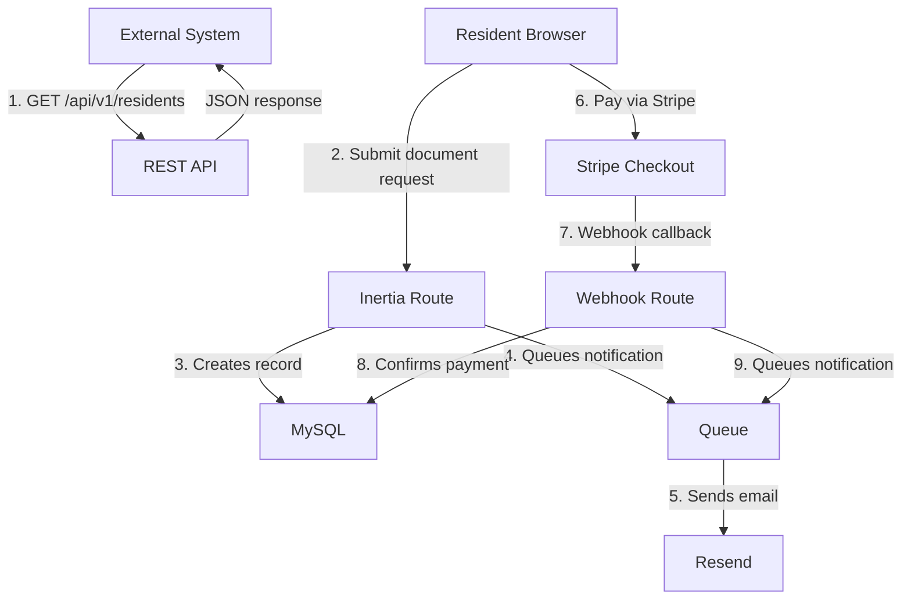

# Integration Design

This document covers the automation integration requirements defined in the project spec (§4.3).

## Integration Map



---

## 1. Email Notification Integration (Resend SMTP)

### Overview

The platform sends transactional emails via [Resend](https://resend.com) using Laravel's built-in SMTP mail driver. No SMS.

### Configuration

```env
MAIL_MAILER=smtp
MAIL_HOST=smtp.resend.com
MAIL_PORT=465
MAIL_USERNAME=resend
MAIL_PASSWORD=re_xxxxxxxxxxxxx
MAIL_ENCRYPTION=tls
MAIL_FROM_ADDRESS=noreply@barangay.example.com
MAIL_FROM_NAME="Barangay Service Platform"
```

### Notification Events

| Event | Trigger | Recipient | Channel |
|---|---|---|---|
| Resident Verified | Staff verifies resident profile | Resident | Email |
| Resident Rejected | Staff rejects resident profile | Resident | Email + Database |
| Document Request Approved | Staff approves request | Resident | Email |
| Document Request Ready | Payment confirmed or no-fee approved | Resident | Email |
| Document Request Released | Staff releases document | Resident | Email |
| Document Request Rejected | Staff rejects request | Resident | Email + Database |
| Payment Confirmed | Stripe webhook / cash recorded | Resident | Email |
| Payment Refunded | Admin refunds payment | Resident | Email |
| Blotter Filed | Complaint recorded | Complainant | Email |
| Hearing Scheduled | Hearing date set | Both parties | Email |
| Blotter Resolved | Case resolved | Both parties | Email |
| Assistance Application Received | Resident applies | Resident | Email + Database |
| Assistance Application Approved | Staff approves | Resident | Email |
| Assistance Application Rejected | Staff rejects | Resident | Email + Database |
| Assistance Disbursed | Aid released | Resident | Email |

### Implementation Pattern

All notifications will:
1. Implement `ShouldQueue` — dispatched to the queue, not sent inline
2. Use Laravel's `Notification` class with `toMail()` and `toDatabase()` methods
3. Use the `database` queue driver (upgradeable to Redis)
4. Be dispatched from Action classes, never from controllers

```php
// Example: Inside ApproveDocumentRequestAction
$request->resident->user->notify(new DocumentRequestApprovedNotification($request));
```

### Email Templates

Laravel Markdown mail templates in each module's notification class. Styled with Laravel's default mail theme (customizable).

### Notification Workflow



---

## 2. Stripe Payment Integration (Sandbox)

### Overview

The platform simulates payment processing using [Stripe Checkout](https://stripe.com/docs/payments/checkout) in sandbox/test mode. This covers:
- **Payment request** — Create a Stripe Checkout Session
- **Transaction confirmation** — Handle webhook event
- **Service activation** — Auto-update document/application status after payment

### Configuration

```env
STRIPE_KEY=pk_test_xxxxxxxxxxxxx
STRIPE_SECRET=sk_test_xxxxxxxxxxxxx
STRIPE_WEBHOOK_SECRET=whsec_xxxxxxxxxxxxx
```

### Integration Approach

**Stripe Checkout (hosted)** — Redirects the user to Stripe's hosted payment page. Simplest integration with the strongest security (no need to handle card data).

**NOT using Laravel Cashier** — Cashier is designed for subscriptions. This is one-off payments. We'll use the Stripe PHP SDK directly via a thin `StripeService` adapter.

### Payment Flow



### Stripe Webhook Events

| Event | Handler Action |
|---|---|
| `checkout.session.completed` | Mark payment as completed; advance payable status |
| `checkout.session.expired` | Mark payment as failed |
| `charge.refunded` | Mark payment as refunded |

### Webhook Security

1. All webhook requests verified via `Stripe-Signature` header
2. Webhook endpoint excluded from CSRF middleware
3. Idempotent handler — processing same event twice has no side effects
4. Webhook secret stored in environment variable only

### Payable Types (Polymorphic)

| Payable Type | Model | Fee Source |
|---|---|---|
| `document_request` | `Modules\DocumentRequest\Models\DocumentRequest` | `document_types.fee` |
| `assistance_application` | `Modules\SocialAssistance\Models\AssistanceApplication` | Manual (if applicable) |

### StripeService Adapter

A thin service class in `app/Services/StripeService.php`:
- `createCheckoutSession(Payment $payment): string` — returns checkout URL
- `verifyWebhookSignature(Request $request): Event` — verifies and parses webhook
- `refund(Payment $payment): void` — initiates refund

---

## 3. Automated Workflow Integration

### Certificate Request Workflow (End-to-End)

This is the primary automated workflow demonstrating all integration points:



### Automation Integration Points

| Step | Automation Type | Technology |
|---|---|---|
| Reference number generation | Auto-generated | Laravel (custom format: `DOC-2026-0001`) |
| Status transitions | Event-driven | Laravel model events / Action classes |
| Email notifications | Queued async | Laravel Notifications + Resend SMTP |
| Payment processing | External API | Stripe Checkout (redirect) |
| Payment confirmation | Webhook | Stripe webhook → Laravel handler |
| Audit logging | Automatic | AuditLog::log() in Actions |
| In-app notifications | Database | Laravel Notification database channel |

---

## 4. Integration Guidelines (for External Systems)

### How to Integrate

1. **Obtain API credentials** — Admin creates an API token via the admin panel
2. **Authenticate** — Include `Authorization: Bearer {token}` in all API requests
3. **Base URL** — `https://{domain}/api/v1`
4. **Rate limits** — 60 requests/minute per token
5. **Pagination** — All list endpoints are paginated. Use `?page=N&per_page=N`

### Example: Get Resident List

```bash
curl -X GET "https://barangay.example.com/api/v1/residents?page=1&per_page=10" \
  -H "Authorization: Bearer {token}" \
  -H "Accept: application/json"
```

### Example: Get Document Request Status

```bash
curl -X GET "https://barangay.example.com/api/v1/document-requests/42" \
  -H "Authorization: Bearer {token}" \
  -H "Accept: application/json"
```

### Example: Stripe Webhook Handling (for testing)

```bash
# Using Stripe CLI for local development
stripe listen --forward-to localhost:8000/webhooks/stripe
stripe trigger checkout.session.completed
```

### Integration Workflow Summary


