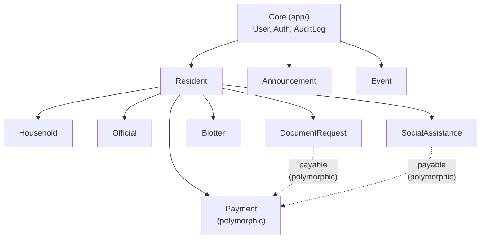

# Module Structure

## Overview

The project uses [nwidart/laravel-modules](https://github.com/nWidart/laravel-modules) v13 to organize feature code into self-contained modules. Each module owns its models, migrations, controllers, routes, views, and tests.

## Current Modules (from `modules_statuses.json`)

| Module | Status | Purpose | Needs Overhaul |
|---|---|---|---|
| `Resident` | ✅ | Resident profiles and registration | Moderate — add DTOs, Form Requests, Policies |
| `Household` | ✅ | Household grouping | Moderate — same as above |
| `Official` | ✅ | Barangay officials | Minor — add Actions |
| `DocumentRequest` | ✅ | Certificate request and issuance | Major — add document_types, workflow engine, Stripe |
| `Payment` | ✅ | Payment records | Major — add Stripe integration, polymorphic cleanup |
| `Announcement` | ✅ | News announcements | Minor |
| `Blotter` | ✅ | Incident/blotter reports | Major — add hearings, case numbers, workflow |
| `Event` | ✅ | Community events | Minor |
| **SocialAssistance** | 🆕 | Social assistance programs | **New module — create from scratch** |

## Target Module Structure

Each module should follow this standard layout:

```
Modules/{ModuleName}/
├── app/
│   ├── Actions/                    # Business logic (one class per use case)
│   │   ├── Create{Entity}Action.php
│   │   ├── Update{Entity}Action.php
│   │   └── ...
│   ├── Data/                       # DTOs / Data Objects for Inertia transfer
│   │   ├── {Entity}Data.php
│   │   └── {Entity}ListData.php
│   ├── Http/
│   │   ├── Controllers/
│   │   │   ├── {Entity}Controller.php          # Admin Inertia controller
│   │   │   └── Api/{Entity}ApiController.php   # REST API controller
│   │   └── Requests/
│   │       ├── Store{Entity}Request.php
│   │       └── Update{Entity}Request.php
│   ├── Models/
│   │   └── {Entity}.php
│   ├── Notifications/
│   │   └── {Event}Notification.php
│   └── Policies/
│       └── {Entity}Policy.php
├── config/
│   └── config.php
├── database/
│   ├── factories/
│   ├── migrations/
│   └── seeders/
├── resources/
│   └── js/
│       └── Pages/
│           └── {ModuleName}/
├── routes/
│   ├── web.php                     # Inertia routes (admin + resident-portal)
│   └── api.php                     # REST API routes
├── tests/
│   ├── Feature/
│   └── Unit/
├── module.json
└── composer.json
```

## Module Dependency Rules



**Hard rules:**
1. Core (`app/`) depends on nothing — it IS the foundation
2. All feature modules depend on Core (User model, auth)
3. `Resident` is the pivot module — most modules depend on it
4. `Payment` uses polymorphic relations to stay decoupled from specific modules
5. Modules MUST NOT have circular dependencies
6. Cross-module references use model FQCNs (e.g., `\Modules\Resident\Models\Resident`)

## Module Details

### Resident Module

**Responsibility:** Resident profile CRUD, registration workflow, verification.

**Key Actions:**
- `CreateResidentAction` — Create resident profile (admin or self-registration)
- `UpdateResidentAction` — Update resident data
- `VerifyResidentAction` — Staff approves resident profile
- `RejectResidentAction` — Staff rejects with notes

**Key Notifications:**
- `ResidentVerifiedNotification` — Email sent when profile is verified
- `ResidentRejectedNotification` — Email sent when profile is rejected

### DocumentRequest Module

**Responsibility:** Certificate request lifecycle from submission to release.

**Key Actions:**
- `CreateDocumentRequestAction` — Submit new request with auto-generated reference number
- `ApproveDocumentRequestAction` — Staff approves, triggers payment requirement
- `RejectDocumentRequestAction` — Staff rejects with remarks
- `ReleaseDocumentRequestAction` — Staff marks as released
- `CancelDocumentRequestAction` — Resident cancels pending request

**Key Notifications:**
- `DocumentRequestApprovedNotification` — Includes payment link if fee > 0
- `DocumentRequestRejectedNotification`
- `DocumentRequestReadyNotification` — Ready for pickup
- `DocumentRequestReleasedNotification`

### Blotter Module

**Responsibility:** Incident/complaint recording, hearing management, resolution.

**Key Actions:**
- `FileBlotterAction` — Record new complaint with auto case number
- `UpdateBlotterAction` — Update case details
- `ScheduleHearingAction` — Create hearing record
- `ResolveBlotterAction` — Mark case as resolved
- `EscalateBlotterAction` — Escalate to higher authority

**Key Notifications:**
- `BlotterFiledNotification` — Confirmation to complainant
- `HearingScheduledNotification` — Notify both parties
- `BlotterResolvedNotification`

### SocialAssistance Module (NEW)

**Responsibility:** Manage assistance programs and process applications.

**Key Actions:**
- `CreateAssistanceProgramAction` — Admin creates program
- `UpdateAssistanceProgramAction` — Update program details
- `ApplyToAssistanceProgramAction` — Resident submits application
- `ReviewAssistanceApplicationAction` — Staff approves/rejects
- `DisburseAssistanceAction` — Mark aid as disbursed

**Key Notifications:**
- `ApplicationReceivedNotification` — Confirmation to applicant
- `ApplicationApprovedNotification`
- `ApplicationRejectedNotification`
- `AssistanceDisbursedNotification`

### Payment Module

**Responsibility:** Polymorphic payment processing via Stripe and cash.

**Key Actions:**
- `CreateStripeCheckoutAction` — Generate Stripe Checkout Session for a payable
- `HandleStripeWebhookAction` — Process Stripe webhook events
- `RecordCashPaymentAction` — Staff records cash payment
- `RefundPaymentAction` — Admin initiates refund

**Key Notifications:**
- `PaymentConfirmedNotification`
- `PaymentRefundedNotification`

### Household, Official, Announcement, Event Modules

These are simpler CRUD modules. They follow the same Actions → DTOs → Policy pattern but with fewer workflow states.

## Shared Infrastructure (Core `app/`)

| Directory | Content |
|---|---|
| `app/Actions/` | Module-spanning actions (if any) |
| `app/Data/` | Shared DTOs (e.g., `PaginationData`) |
| `app/Http/Middleware/` | Custom middleware |
| `app/Models/` | `User`, `Role` (Spatie), `AuditLog` |
| `app/Notifications/` | Base notification classes |
| `app/Policies/` | Core policies |
| `app/Providers/` | Service providers |
| `app/Services/` | Infrastructure adapters (Stripe service, audit service) |
