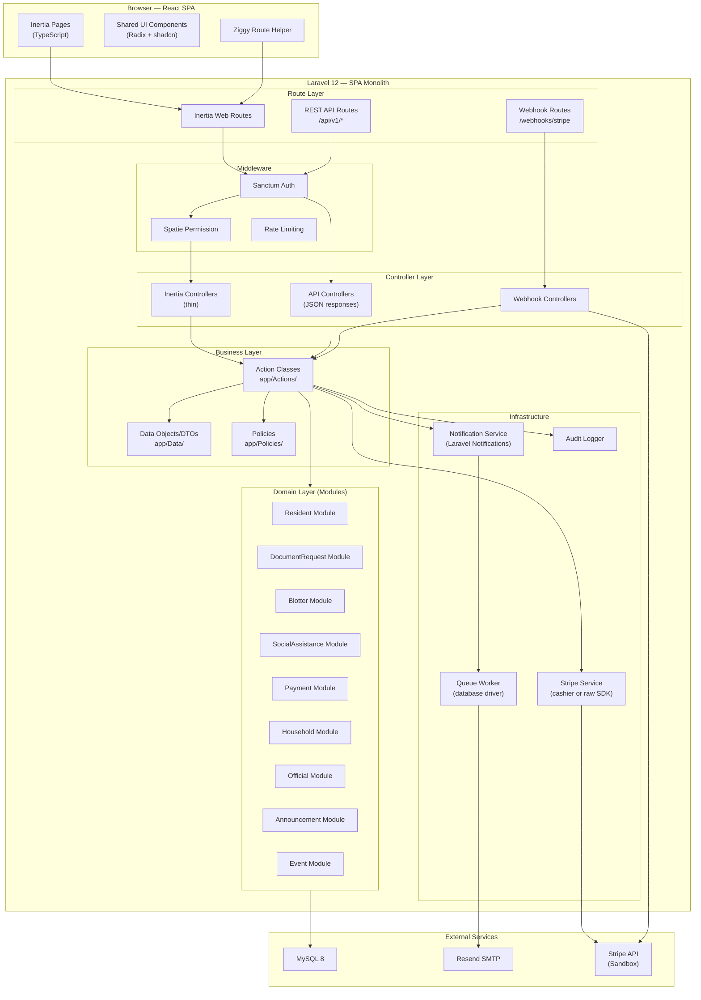
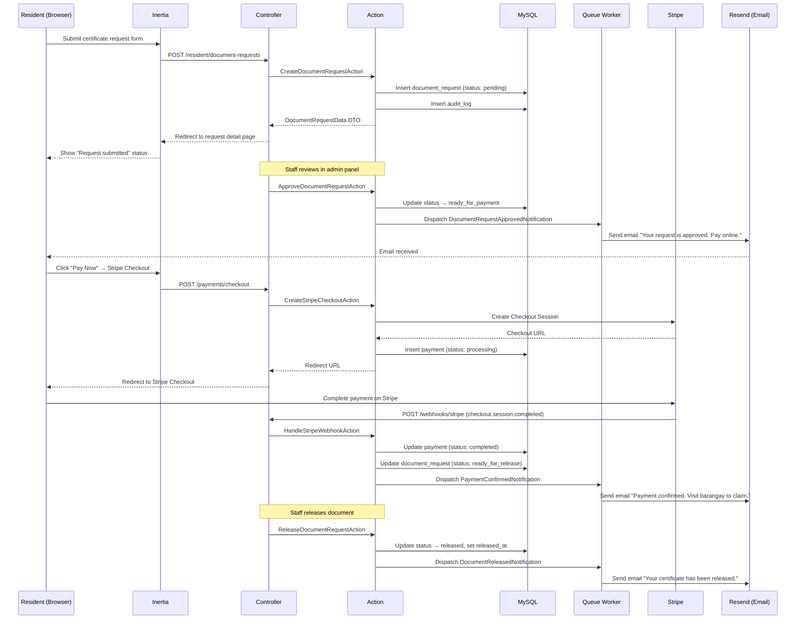
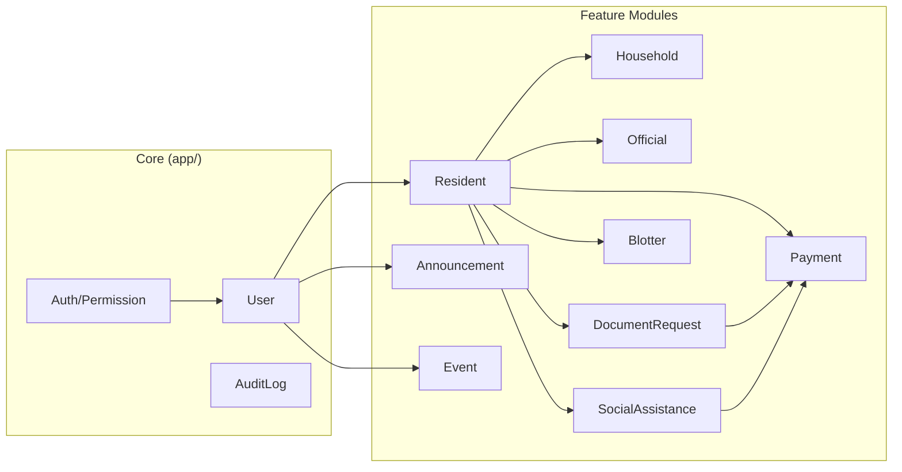

# System Architecture

## Architecture Type

**SPA Monolith** — a single Laravel application serving a React single-page application via Inertia.js. No separate frontend deployment. No separate API server. The browser talks to one Laravel instance that returns Inertia page responses (JSON) instead of Blade HTML.

```
┌─────────────────────────────────────────────────────────┐
│                    Browser (Client)                      │
│  React 18 SPA — TypeScript — Inertia.js Client          │
│  Tailwind CSS — Radix UI — shadcn-style components      │
└──────────────────────────┬──────────────────────────────┘
                           │ Inertia Protocol (XHR w/ session cookies)
                           │ + REST API (for external/webhook)
┌──────────────────────────▼──────────────────────────────┐
│                    Laravel 12 (PHP 8.2+)                 │
│  ┌────────────┐ ┌────────────┐ ┌──────────────────────┐ │
│  │  Inertia   │ │  REST API  │ │  Webhook Endpoints   │ │
│  │  Routes    │ │  Routes    │ │  (Stripe callbacks)  │ │
│  └─────┬──────┘ └─────┬──────┘ └──────────┬───────────┘ │
│        │              │                    │             │
│  ┌─────▼──────────────▼────────────────────▼───────────┐ │
│  │              Middleware Pipeline                      │ │
│  │  Sanctum Auth │ CORS │ Spatie Permission │ Throttle  │ │
│  └─────────────────────┬───────────────────────────────┘ │
│                        │                                 │
│  ┌─────────────────────▼───────────────────────────────┐ │
│  │            Controllers (thin orchestration)          │ │
│  │  Authorize → Validate → Delegate → Return Response   │ │
│  └─────────────────────┬───────────────────────────────┘ │
│                        │                                 │
│  ┌─────────────────────▼───────────────────────────────┐ │
│  │           Actions (business logic)                   │ │
│  │  Single-responsibility classes in app/Actions/       │ │
│  └────┬────────────────┬───────────────────┬───────────┘ │
│       │                │                   │             │
│  ┌────▼────┐  ┌────────▼────────┐  ┌──────▼──────────┐  │
│  │ Eloquent│  │  Notifications  │  │  External APIs  │  │
│  │ Models  │  │  (Resend SMTP)  │  │  (Stripe SDK)   │  │
│  └────┬────┘  └────────┬────────┘  └──────┬──────────┘  │
│       │                │                   │             │
└───────┼────────────────┼───────────────────┼─────────────┘
        │                │                   │
   ┌────▼────┐    ┌──────▼──────┐     ┌──────▼──────┐
   │  MySQL  │    │   Resend    │     │   Stripe    │
   │  8.x    │    │   (SMTP)    │     │  (Sandbox)  │
   └─────────┘    └─────────────┘     └─────────────┘
```

## Component Diagram



## Data Flow: Certificate Request Lifecycle

This demonstrates the complete automated workflow integration (project requirement §4.3):



## Module Dependency Map



**Dependency rules:**
- Core depends on nothing
- `Resident` depends on Core (User)
- `Household` depends on Resident
- `Official` depends on Resident
- `DocumentRequest` depends on Resident
- `Blotter` depends on Resident
- `SocialAssistance` depends on Resident
- `Payment` depends on Resident (polymorphic — does NOT directly depend on DocumentRequest or SocialAssistance)
- `Announcement` depends on Core (User)
- `Event` depends on Core (User)

No circular dependencies. Payment uses polymorphic relations to stay decoupled.

## Scalability Considerations

| Concern | Strategy |
|---|---|
| **Database load** | Eager loading enforced via Actions; indexes on all filtered columns; paginate all list endpoints |
| **Email throughput** | Queued notifications via database driver (upgradeable to Redis); Resend handles delivery |
| **Payment processing** | Async via Stripe webhooks — no blocking requests; idempotent webhook handler |
| **Module growth** | nwidart/laravel-modules enables adding new service areas without touching core |
| **Horizontal scaling** | Stateless PHP (session in DB/Redis) — can scale to multiple app servers behind a load balancer |
| **API rate limiting** | Laravel's built-in throttle middleware on all API routes |

## Security Considerations

| Concern | Mitigation |
|---|---|
| **Authentication** | Sanctum session-based auth; CSRF protection; HTTP-only cookies |
| **Authorization** | Spatie Permission for RBAC + Laravel Policies for resource-level checks |
| **Input validation** | Form Requests on every write endpoint; no inline validation |
| **SQL injection** | Eloquent parameterized queries; no raw DB::statement with user input |
| **XSS** | React's JSX auto-escaping; Inertia's server-driven rendering |
| **CSRF** | Laravel's CSRF middleware on all non-API routes; Sanctum CSRF cookie flow |
| **Mass assignment** | Explicit `$fillable` on all models |
| **Stripe webhooks** | Signature verification on all webhook endpoints |
| **Data exposure** | DTOs map model data — internal fields never leak to frontend |
| **Rate limiting** | Throttle middleware on auth routes and API endpoints |
| **Audit trail** | All mutations logged with user, IP, before/after values |

## Limitations

| Limitation | Explanation |
|---|---|
| **Single server** | Current design assumes single-server deployment. Horizontal scaling requires session/cache migration to Redis. |
| **No real-time** | No WebSocket support. Residents must refresh or use polling for status updates. Can be added later with Laravel Reverb. |
| **No SMS** | Only email notifications via Resend. No SMS channel. |
| **Stripe sandbox** | Payment integration is demo/test mode only. Production Stripe requires additional PCI compliance review. |
| **No offline support** | SPA requires internet connectivity. Offline-first would require significant PWA work. |
| **Single-barangay** | Current design is single-tenant (one barangay). Multi-barangay would require tenant scoping. |
